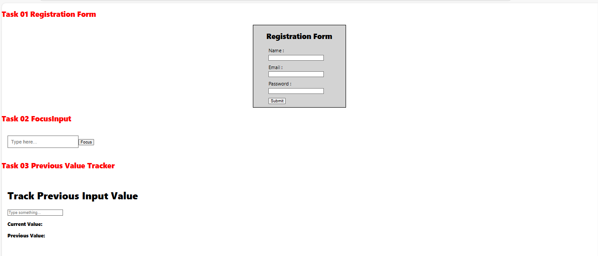
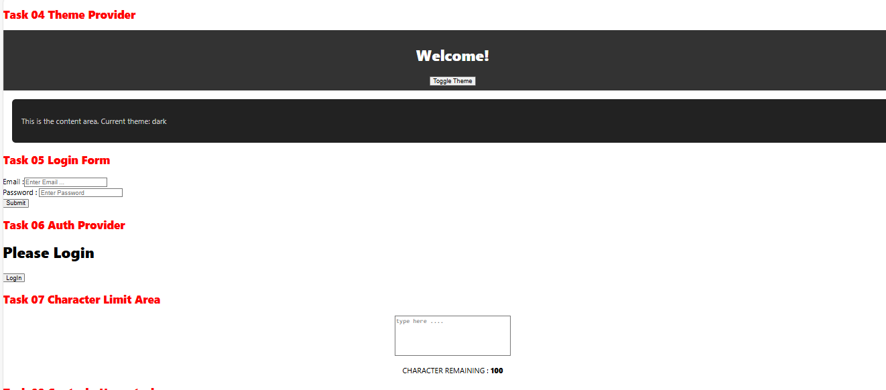
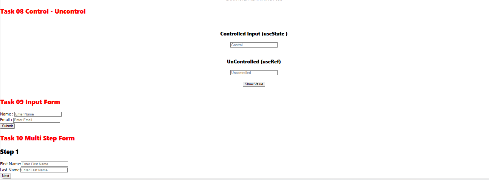

#  React Practice Challenges – Level 3

This repository contains 10 advanced React.js practice components, focused on mastering advanced topics like useRef, useContext, controlled vs uncontrolled inputs, custom hooks, form validation, and multi-step form logic.

 **Live App:**  
[View the Live App](https://muhammadshoaib20.github.io/React-Challenges-level-03)

---

##  App Preview





---


---

## ✅ List of Level 3 Challenges

| #   | Challenge Name                 | Key Concepts Used                                        |
|-----|-------------------------------|-----------------------------------------------------------|
| 1️⃣ | Form with Validation           | useState, form validation, error messages                |
| 2️⃣ | useRef Focus                   | useRef, programmatic input focus                         |
| 3️⃣ | Shared Theme with useContext   | useContext, global state, conditional styling            |
| 4️⃣ | Track Previous Value           | useRef, useEffect, track previous state                  |
| 5️⃣ | Form Auto-Focus on Load        | useRef, useEffect, focus on mount                        |
| 6️⃣ | Context-based Auth Display     | useContext, conditional rendering, login/logout state    |
| 7️⃣ | Character Limit Indicator      | useState, textarea input tracking                        |
| 8️⃣ | Controlled vs Uncontrolled     | useState, useRef, input comparison                       |
| 9️⃣ | Custom Hook – useInput         | Custom hook, reusability, controlled inputs              |
| 🔟 | Multi-Step Form (3 Steps)       | useState, step management, form composition              |

---

## 🧪 How to Run Locally

```bash
git clone https://github.com/MuhammadShoaib20/React-Challenges-level-03.git
cd react-level-3-practice
npm install
npm start

```

---

##  Deployment

This project is deployed using **GitHub Pages** with the help of the `gh-pages` package.

###  Steps to Deploy

```bash
npm install
npm run build
npm run deploy
```

---


###  Live App

[https://muhammadshoaib20.github.io/React-Challenges-level-03](https://muhammadshoaib20.github.io/React-Challenges-level-03)


---

## Author

👤 **Muhammad Shoaib**  
💼 [GitHub Profile](https://github.com/MuhammadShoaib20)

---

## ⭐️ Give it a Star

If you found this repository helpful, consider giving it a ⭐ on GitHub.
It helps others discover it and motivates me to build more cool stuff!


🌟 [Star this repo](https://github.com/MuhammadShoaib20/React-Challenges-level-03.git)


